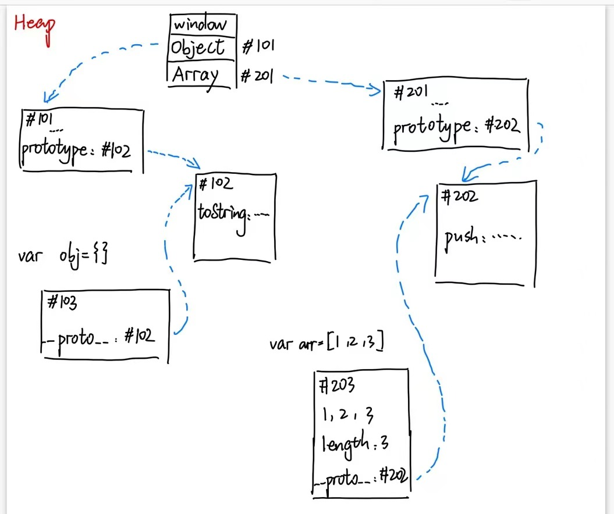

# 内存图与JS世界

## 几个英文单词
* Operating System 操作系统
* runtime 运行时（需要的东西）
* environment 环境，简称env
* person 一个人
* kernel 内核
* compile 编译
* memory 记忆。存储
* people 一群人

## JS引擎的主要功能
1. 编译：把JS代码翻译为机器能执行的字节码或机器码
2. 优化：改写代码，使其更高效
3. 执行：执行上面的字节码和机器码
4. 垃圾回收：把JS用完的内存回收，方便之后再次使用

## 瓜分代码
* JS代码在哪里运行？内存
* 数据分为：非对象和对象
* 非对象在Stack栈，每个数据顺序存放
* 对象在Heap堆，每个数据随机存放

## 写JS要有什么
* console document 对象 数组（一种特殊的对象） 函数（一种特殊的对象）

## 原型链
* 每个对象都有一个隐藏属性
* 